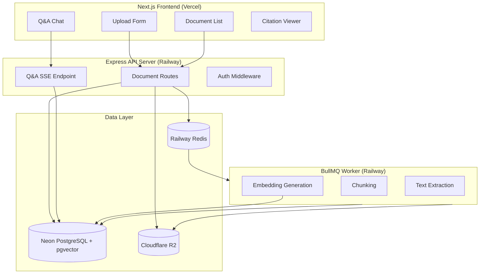
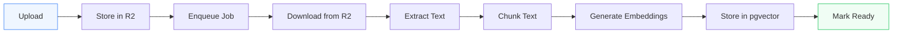

# DocQA — Technical Overview

## Project Context

DocQA is App 4 in a portfolio of progressive fullstack AI applications. It introduces the **RAG (Retrieval-Augmented Generation)** pattern: chunking, embedding, vector search, grounded prompt assembly, and streaming answers with citations. The chunking module is designed for reuse in later apps.

## Architecture Overview



## Tech Stack

| Layer | Technology | Purpose |
|-------|-----------|---------|
| Frontend | Next.js 15 + React 19 | App router, SSR, client components |
| API | Express + TypeScript | REST endpoints, SSE streaming |
| Worker | BullMQ | Background document processing |
| Database | Neon PostgreSQL + pgvector | Relational data + vector similarity search |
| File Storage | Cloudflare R2 | S3-compatible document storage |
| Queue | Railway Redis | Job queue for BullMQ |
| Auth | Custom session-based | Cookie + bcrypt password hashing |
| LLM | Anthropic Claude API | Completion generation |
| Embeddings | Voyage AI | Vector embedding generation |
| Styling | SCSS Modules | Scoped component styles |

## Monorepo Structure

```
document-qa-rag/
├── web-client/          # Next.js frontend
│   └── src/
│       ├── app/         # App router pages
│       ├── components/  # Shared components
│       ├── context/     # Auth context
│       └── lib/         # API client utilities
├── server/              # Express API
│   └── src/
│       ├── routes/      # Route handlers
│       ├── services/    # Business logic
│       ├── repos/       # Database access
│       └── middleware/  # Auth, error handling
├── worker/              # BullMQ worker
│   └── src/
│       ├── processors/  # Job processors
│       └── services/    # Chunking, embedding
├── common/              # Shared utilities
│   └── chunker/         # Reusable text chunking
└── docs/                # Documentation
```

## Database Schema

### users

```sql
CREATE TABLE users (
  id UUID PRIMARY KEY DEFAULT gen_random_uuid(),
  email TEXT UNIQUE NOT NULL,
  first_name TEXT,
  last_name TEXT,
  password_hash TEXT NOT NULL,
  created_at TIMESTAMPTZ DEFAULT now()
);
```

### documents

```sql
CREATE TABLE documents (
  id UUID PRIMARY KEY DEFAULT gen_random_uuid(),
  user_id UUID NOT NULL REFERENCES users(id),
  filename TEXT NOT NULL,
  r2_key TEXT NOT NULL,
  mime_type TEXT NOT NULL,
  size_bytes INTEGER NOT NULL,
  status TEXT NOT NULL DEFAULT 'uploaded',
  total_chunks INTEGER,
  error TEXT,
  created_at TIMESTAMPTZ DEFAULT now()
);
```

### chunks

```sql
CREATE TABLE chunks (
  id UUID PRIMARY KEY DEFAULT gen_random_uuid(),
  document_id UUID NOT NULL REFERENCES documents(id) ON DELETE CASCADE,
  user_id UUID NOT NULL REFERENCES users(id),
  chunk_index INTEGER NOT NULL,
  content TEXT NOT NULL,
  token_count INTEGER NOT NULL,
  embedding vector(1024) NOT NULL,
  created_at TIMESTAMPTZ DEFAULT now()
);

CREATE INDEX chunks_embedding_idx
  ON chunks USING ivfflat (embedding vector_cosine_ops)
  WITH (lists = 100);
```

### conversations

```sql
CREATE TABLE conversations (
  id UUID PRIMARY KEY DEFAULT gen_random_uuid(),
  user_id UUID NOT NULL REFERENCES users(id),
  title TEXT,
  created_at TIMESTAMPTZ DEFAULT now()
);
```

### messages

```sql
CREATE TABLE messages (
  id UUID PRIMARY KEY DEFAULT gen_random_uuid(),
  conversation_id UUID NOT NULL REFERENCES conversations(id) ON DELETE CASCADE,
  role TEXT NOT NULL,
  content TEXT NOT NULL,
  cited_chunk_ids UUID[] DEFAULT '{}',
  created_at TIMESTAMPTZ DEFAULT now()
);
```

## API Reference

### Authentication

| Method | Path | Description |
|--------|------|-------------|
| POST | `/auth/register` | Create account (email, password, first_name, last_name) |
| POST | `/auth/login` | Log in, sets session cookie |
| POST | `/auth/logout` | Log out, clears session |
| GET | `/auth/me` | Get current user |

### Documents

| Method | Path | Description |
|--------|------|-------------|
| GET | `/documents` | List user's documents |
| POST | `/documents` | Upload a document (multipart form) |
| DELETE | `/documents/:id` | Delete a document and its chunks |

### Q&A

| Method | Path | Description |
|--------|------|-------------|
| POST | `/qa` | Ask a question (SSE streaming response) |

**POST /qa** request body:

```json
{
  "question": "What does the document say about X?",
  "conversation_id": "optional-uuid"
}
```

SSE event types:
- `token` — streamed answer token
- `citations` — array of cited chunks with document metadata
- `done` — stream complete, includes `conversation_id`
- `error` — error message

## Document Processing Pipeline



1. **Upload** — File is uploaded via multipart form to the API.
2. **Store in R2** — API stores the raw file in Cloudflare R2 under `documents/{user_id}/{doc_id}/{filename}`.
3. **Enqueue Job** — A BullMQ job is added to the `document-process` queue.
4. **Download from R2** — Worker downloads the file from R2.
5. **Extract Text** — PDF files are parsed with `pdf-parse`; TXT/MD files are read directly.
6. **Chunk Text** — Text is split into ~500-token chunks with 50-token overlap using a recursive character splitter.
7. **Generate Embeddings** — Chunks are batched and sent to the Voyage AI embedding API.
8. **Store in pgvector** — Chunks and their vector embeddings are inserted into the `chunks` table.
9. **Mark Ready** — Document status is updated to `ready` and `total_chunks` is set.

## Q&A Flow

1. User submits a question.
2. API generates an embedding for the question using the same embedding model.
3. Vector similarity search finds the top-k most relevant chunks (cosine distance), scoped to the user's documents.
4. Retrieved chunks are assembled into a system prompt with citation instructions.
5. The prompt + question are sent to Claude API with streaming enabled.
6. Tokens are streamed back to the client via SSE.
7. Citation metadata is sent as a separate SSE event.
8. The Q&A exchange is persisted in the conversations/messages tables.

## Key Design Decisions

- **pgvector over dedicated vector DB** — At this scale, pgvector in Neon handles vector search without adding another service. IVFFlat indexing keeps queries fast.
- **Cloudflare R2 for file storage** — Zero egress fees and S3-compatible API. Documents are stored once and downloaded by the worker for processing.
- **Overlapping chunks** — 50-token overlap ensures important context at chunk boundaries is captured in at least one chunk.
- **User-scoped search** — All vector queries include a `user_id` filter so users only search their own documents.
- **SSE for streaming** — Server-Sent Events provide a simple, HTTP-native streaming mechanism for token-by-token delivery.
- **Session-based auth** — Cookie-based sessions with bcrypt password hashing. Simple and stateless from the frontend's perspective.
